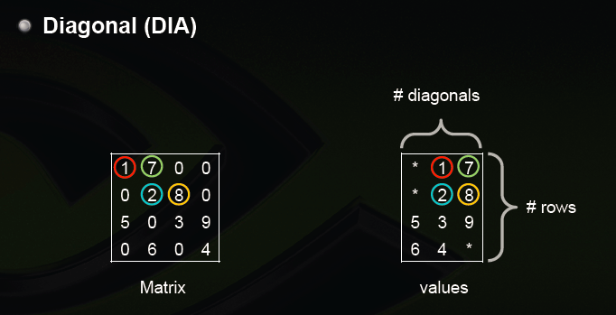

# 稀疏矩阵ST格式转换为DIA格式

## 目标

将ST格式存储的稀疏矩阵转换为DIA格式存储

例：  

将ST格式矩阵：  

转换为DIA格式：  


## 主要文件

* read.txt: 存储ST格式稀疏矩阵的文件, 用于程序读取
* output.txt: 存储程序运行结果
* st_to_dia.c: 功能函数的实现
* st_to_dia_test.c: 测试

## 函数及参数含义

1. dpre_usconv_st2dia
```c
void dpre_usconv_st2dia(
    int m, int n,double* ast,int n_ast,int* ist,
    int* jst,int* LDA,int* NDIAG, int **idiag, 
    double **val_dia
)
```
功能：

    将st格式矩阵转换为dia格式，将结果保存在数组中

参数说明：

    int m: 矩阵行数  
    int n: 矩阵列数  
    double* ast: 非零元数组  
    int n_ast: 非零元个数  
    int* ist: 行偏移数组  
    int* jst: 列偏移数组    
    int* LDA: 保存DIA格式矩阵的对角线长度  
    int* NDIAG: 保存DIA格式矩阵的对角线个数  
    int **idiag: 将生成的对角线偏移编号带出函数。中心对角线为0，向右上递增为1,2，…,向左下递减为-1.-2,….  
    double **val_dia: 将转换后生成的结果数组带出函数。此数组为一维数组，按行优先保存生成的二维数组。

2. st_read
```c
int st_read(char* filename,double **ast,int **ist, int **jst)
```
功能：

    从文件中读取st格式稀疏矩阵，将结果保存在三个数组中

参数说明：

char* filename: 保存st格式稀疏矩阵的文件的文件名
double* ast: 非零元数组  
int n_ast: 非零元个数  
int* ist: 行偏移数组  

3. dia_write
```c
void dia_write(char* filename, double *val, 
    int *indx, int lda, int ndiag)
```
功能：

    将在转换后生成的数组中保存的DIA格式稀疏矩阵输出到文件中

参数说明：

    char* filename: 保存输出结果的文件的文件名
    double *val: 结果数组, 在此一维数组中保存DIA格式矩阵的所有元素(包含0)
    int *indx: 对角线编号数组
    int lda: 对角线长度
    int ndiag: 对角线个数

4. st2dia
```c
void st2dia(char* readFile, char* writeFile, 
        int m, int n, int n_val)
```
功能：
    
    将程序主要功能封装在此函数中。即仅需调用此函数即可完成两种矩阵格式的转换。

参数说明：

    char* readFile: 输入文件名
    char* writeFile: 输出文件名
    int m: 矩阵行数
    int n: 矩阵列数
    int n_val: 非零元个数

